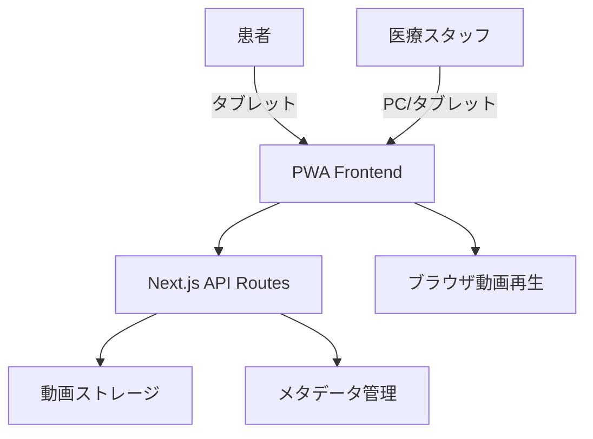

# 要件定義書

## 1. プロジェクト概要

### 1.1 プロジェクト名
- 医療機関向け検査・治療説明動画管理システム

### 1.2 背景・目的
- **背景**: 医療機関では様々な検査や治療が行われているが、これらを行う際に患者に対して治療の方法を説明する必要がある。説明については医師や看護師が口頭もしくは資料を用いて説明するが、人員や時間を確保しなければならず、より良い手法を検討している。
- **目的**: 医師・看護師の説明業務を動画コンテンツで代替し、患者の待ち時間を活用した説明提供により、医療スタッフの業務負荷軽減と患者満足度向上を実現する。

### 1.3 システムのビジョン / スコープ
- **ビジョン**: 医療機関における検査・治療説明の効率化を図るPWAアプリケーションとして、医療スタッフの説明業務を動画コンテンツで代替し、患者の待ち時間を活用した説明提供により、医療スタッフの業務負荷軽減と患者満足度向上を実現する。
- **スコープ**: 今回はPWAアプリケーションとしてMVPを実装。自施設のみでの使用を前提としたアプリケーションであるため収益・競合・成長戦略等については考慮しない。将来的に外部システム連携や多施設展開を想定しているが、本フェーズでは対象外。

---

## 2. ビジネス要件

### 2.1 ビジネスモデル情報（任意）
- **リーンキャンバス**: 自施設のみでの使用を前提としたアプリケーションであるため収益・競合・成長戦略等については考慮しない
- **7Powers分析**: 自施設のみでの使用を前提としたアプリケーションであるため収益・競合・成長戦略等については考慮しない。7Powers分析は適用しない。
- **市場規模 / 成長予測**: 自施設のみでの使用を前提としたアプリケーションであるため収益・競合・成長戦略等については考慮しない

### 2.2 成果指標（KPI/KGI）
- **説明業務時間短縮**: 従来の説明時間を50%削減
- **患者満足度向上**: 説明内容の理解度向上
- **医療スタッフの業務効率化**: 説明業務に費やす時間の削減
- **動画コンテンツ利用率**: 月間動画視聴回数の向上

### 2.3 ビジネス上の制約
- **予算制約**: 制約なし
- **開発期間**: 指定なし
- **チーム規模**: Web系開発者1名のみ
- **法的要件**: 個人情報保護、その他医療関連法規・法令の遵守

---

## 3. ユーザー要件

### 3.1 ユーザープロファイル / ペルソナ
- **医療スタッフ**: 医師・看護師（説明動画を作成しアップロードする）
  - 年齢層: 20-60代
  - 利用シーン: 診療業務中、説明資料作成時
  - 利用デバイス: PC、タブレット
  - 課題: 説明の手間を省きたい、同じ説明を繰り返し行う必要がある
- **患者**: 検査・治療を受ける患者（説明を受ける）
  - 年齢層: 全年齢
  - 利用シーン: 診察や会計等、病院での待ち時間
  - 利用デバイス: タブレット
  - 課題: 待ち時間の有効活用、説明内容の理解

### 3.2 ユーザーストーリー
1. **医師として、検査説明動画を簡単にアップロードしたい。なぜなら患者への説明時間を短縮できるからだ。**
2. **看護師として、治療説明動画をカテゴリ別に整理したい。なぜなら患者が必要な説明を素早く見つけられるからだ。**
3. **患者として、待ち時間に検査説明動画を視聴したい。なぜなら診察前に内容を理解しておけるからだ。**
4. **患者として、タブレットで直感的に動画を操作したい。なぜなら高齢者でも簡単に使えるからだ。**
5. **医療スタッフとして、動画の視聴状況を把握したい。なぜなら説明効果を測定できるからだ。**

### 3.3 MVP（Minimum Viable Product）の定義
- **MVP で実装する範囲**: 動画管理システム、カテゴリ分類機能、タブレット最適化再生の3つのコア機能
- **MVP のゴール**: 基本的な動画アップロード・再生機能の提供、医療スタッフの説明業務効率化

---

## 4. 機能要件

### 4.1 機能一覧 / MoSCoW 分類

| 機能 ID | 機能名 | 要約 | Must/Should/Could/Won't | MVP 対象 |
| ------- | ------ | ---- | ----------------------- | -------- |
| F001 | 動画管理システム | 検査・治療説明動画のアップロード・保存・削除機能 | Must | Yes |
| F002 | カテゴリ分類機能 | 検査種別、治療種別、緊急度による動画の分類・整理機能 | Must | Yes |
| F003 | タブレット最適化再生 | タッチ操作対応の動画再生機能 | Must | Yes |
| F004 | オフライン対応 | 動画のローカルキャッシュ機能 | Should | No |
| F005 | 検索・フィルタ機能 | キーワード検索、カテゴリフィルタ、最近視聴、お気に入り機能 | Should | No |
| F006 | 医療機関専用カスタマイズ | 施設ロゴ・ブランディング適用、医療機関固有の説明内容テンプレート機能 | Could | No |
| F007 | アクセシビリティ配慮 | 字幕表示機能、高コントラスト表示モード、音声ガイダンス対応 | Could | No |
| F008 | 多言語対応 | 日本語・英語・その他言語での動画管理、言語別カテゴリ分類 | Could | No |
| F009 | 視聴履歴・統計管理 | 患者の視聴履歴記録、人気動画ランキング、視聴時間統計機能 | Won't | No |
| F010 | 説明効果測定 | 視聴完了率の追跡、医療スタッフ向けレポート機能 | Won't | No |

### 4.2 機能詳細仕様

#### 4.2.1 `<機能 ID: F001 動画管理システム>`
- **概要**: 検査・治療説明動画のアップロード・保存・削除機能。動画メタデータ（タイトル、説明、カテゴリ、作成日時）の管理を含む
- **ユースケース**: 「医療スタッフが新しい説明動画をアップロードするとき」
- **前提条件**: 動画ファイルが準備されている、カテゴリ分類機能が利用可能
- **正常系フロー**: 
  1. 医療スタッフが動画アップロード画面を開く
  2. 動画ファイルを選択・アップロード
  3. メタデータ（タイトル、説明、カテゴリ）を入力
  4. アップロード完了 → 動画一覧に表示
- **例外系フロー**:
  - 動画ファイルサイズが上限（500MB）を超える場合
  - サポートされていない動画形式の場合
  - 必須メタデータが未入力の場合
- **UI 要件**:
  - ドラッグ&ドロップでの動画アップロード
  - アップロード進捗の表示
  - エラー時の分かりやすいメッセージ表示
- **非機能面注意**:
  - セキュリティ（動画データの暗号化保存）
  - レスポンス性能（アップロード完了まで適切な時間内）

#### 4.2.2 `<機能 ID: F002 カテゴリ分類機能>`
- **概要**: 検査種別、治療種別、緊急度による動画の分類・整理機能。階層構造での管理と検索を可能にする
- **ユースケース**: 「医療スタッフが動画を適切なカテゴリに分類するとき」
- **前提条件**: 動画管理システムが利用可能
- **正常系フロー**: 
  1. 医療スタッフがカテゴリ管理画面を開く
  2. 新しいカテゴリを作成または既存カテゴリを選択
  3. 動画にカテゴリを割り当て
  4. カテゴリ別に動画が整理される
- **例外系フロー**:
  - カテゴリ名が重複する場合
  - 階層構造が複雑になりすぎる場合
- **UI 要件**:
  - 直感的なカテゴリ選択UI
  - 階層構造の視覚的表示
- **非機能面注意**:
  - データ整合性（カテゴリ削除時の動画再分類）

#### 4.2.3 `<機能 ID: F003 タブレット最適化再生>`
- **概要**: タッチ操作対応の動画再生機能。フルスクリーン表示、音量調整、再生速度調整を含む
- **ユースケース**: 「患者がタブレットで説明動画を視聴するとき」
- **前提条件**: 動画管理システムが利用可能
- **正常系フロー**: 
  1. 患者が動画一覧から動画を選択
  2. 動画再生画面が表示される
  3. タッチ操作で再生・一時停止・シーク操作
  4. フルスクリーン表示、音量・速度調整
- **例外系フロー**:
  - 動画ファイルが破損している場合
  - ネットワーク接続が不安定な場合
- **UI 要件**:
  - 大きなタッチターゲット
  - 直感的な操作UI
  - 高齢者にも使いやすいデザイン
- **非機能面注意**:
  - レスポンス性能（動画再生開始まで3秒以内）
  - アクセシビリティ（字幕表示、高コントラスト表示）

---

## 5. 非機能要件

### 5.1 パフォーマンス要件
- **レスポンス時間**: 動画再生開始まで3秒以内、動画一覧表示まで1秒以内
- **同時接続数**: 同一医療機関内での同時利用（想定10-20台のタブレット）
- **処理量**: 動画ファイルサイズ最大500MB、同時アップロード数最大5ファイル
- **動画再生性能**: 1080p動画のスムーズな再生、バッファリング時間最小化

### 5.2 セキュリティ要件
- **認証／認可**: 医療スタッフ向け管理機能の認証、患者向けは認証不要
- **データ保護**: 個人情報保護法遵守、動画データの暗号化保存
- **アクセス制御**: 医療機関内ネットワークからのみアクセス可能
- **コンプライアンス**: 医療関連法規・法令の遵守、患者データの適切な管理

### 5.3 可用性・信頼性
- **稼働率**: 医療機関営業時間内（平日8:00-18:00）の99%可用性
- **障害時の復旧手順 / DR 対応**: 動画データの定期バックアップ、メタデータの冗長化
- **データ整合性**: 動画ファイルとメタデータの整合性保証

### 5.4 ユーザビリティ / UI・UX
- **アクセシビリティ**: 字幕表示、高コントラスト表示、音声ガイダンス対応
- **多言語対応の有無**: 日本語・英語対応、将来的な他言語拡張可能性
- **操作導線**: タブレット最適化UI、直感的な操作、大きなタッチターゲット
- **オフライン利用**: ネットワーク切断時も基本機能が利用可能

### 5.5 スケーラビリティ
- **水平/垂直スケーリング**: 自施設専用のため大規模スケーリングは不要
- **ストレージ拡張**: 動画データ増加に対応したストレージ容量拡張

---

## 6. インテグレーション要件

### 6.1 外部サービス / SaaS 連携
- **ストレージ系**: 動画ファイル保存用のローカルストレージまたはクラウドストレージ
- **認証系**: 医療スタッフ向けの簡易認証システム（必要に応じて）

### 6.2 API 仕様
- **提供・利用 API**: REST API
- **エンドポイント例**:
  - `POST /api/videos` - 動画アップロード
  - `GET /api/videos` - 動画一覧取得
  - `GET /api/videos/{id}` - 動画詳細取得
  - `PUT /api/videos/{id}` - 動画情報更新
  - `DELETE /api/videos/{id}` - 動画削除
- **HTTP メソッド**とリクエスト / レスポンスフォーマット（JSON）

### 6.3 データ連携要件
- **データ形式**: JSON
- **頻度**: リアルタイム
- **再送制御**: 通信失敗時のリトライ制御

---

## 7. 技術選定とアーキテクチャ

### 7.1 技術スタックの要約
- **フロントエンド**: React または Next.js
- **バックエンド**: Next.js の API Routes
- **アプリケーション形式**: PWA（Progressive Web App）
- **デプロイ先**: タブレット端末
- **動画処理**: アプリケーション内動画保存・再生機能

### 7.2 アーキテクチャ概要
- **UI 層**: React/Next.js PWA
- **API 層**: Next.js API Routes
- **ストレージ層**: ローカルストレージ + クラウドストレージ（必要に応じて）
- **動画処理層**: ブラウザネイティブ動画再生機能

### 7.3 システム構成図

---

## 8. 開発プロセス / スケジュール

### 8.1 開発モデル・プロセス
- **アジャイル / イテレーティブ**: MVP → フィードバック → 改善
- **段階的開発**: コア機能から順次実装

### 8.2 スケジュール例

| フェーズ | 期間 | 主なタスク |
| -------- | ---- | ---------- |
| 要件定義 | 1ヶ月 | ユーザーストーリー作成、機能リスト確定、MoSCoW分類 |
| デザイン | 1ヶ月 | UI/UXデザイン案作成、タブレット最適化モックアップ |
| 実装（MVP） | 2ヶ月 | フロント/バックエンド実装、動画管理機能 |
| テスト | 1ヶ月 | 機能テスト、UIテスト、タブレット動作確認 |
| リリース＆検証 | 1ヶ月 | 医療機関での検証、改善要望収集、次フェーズ計画 |

---

## 9. リスクと課題

### 9.1 リスク一覧

| No | リスク内容 | 影響度 | 発生確率 | 対応策 |
| -- | ---------- | ------ | -------- | ------ |
| R1 | 動画ファイルサイズによる性能問題 | 高 | 中 | 動画圧縮、ストリーミング対応 |
| R2 | 開発要員の不足（1名のみ） | 中 | 高 | 機能開発の優先度見直し、段階的実装 |
| R3 | セキュリティ脆弱性 | 高 | 中 | 定期的な脆弱性診断、データ暗号化 |
| R4 | タブレット環境での動作問題 | 中 | 中 | 複数デバイスでのテスト、PWA最適化 |

### 9.2 課題 / 前提条件
- チームのスキルセット（Web系開発者1名のみ）
- 医療機関内でのネットワーク環境
- 動画ファイルの管理・バックアップ方針

---

## 10. ランニング費用と運用方針

### 10.1 ランニング費用の目安
- **開発環境**: 無料ツール中心（GitHub、Vercel等）
- **ストレージ**: ローカルストレージ中心、必要に応じてクラウドストレージ
- **運用費用**: 月額0-50ドル程度（小規模運用）

### 10.2 運用・保守体制
- **運用チーム**: 1名（開発者兼運用担当）
- **監視ツール**: ブラウザ開発者ツール、ログ機能
- **アップデート頻度**: 月1回程度を目安

---

## 11. 変更管理
- 要件変更の合意プロセス（医療機関との協議）
- GitHub Issue / Pull Request での履歴管理
- 段階的機能追加による影響範囲の最小化

---

## 12. 参考資料 / 関連ドキュメント
- システム要件抽出プロンプト
- 要件定義書出力プロンプト
- 医療関連法規・法令の遵守ガイドライン
