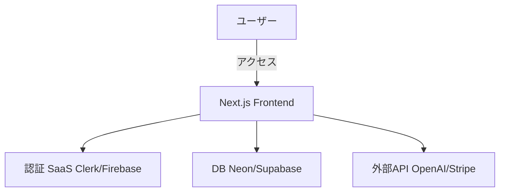

# 要件定義書テンプレート 

## 1. プロジェクト概要 

### 1.1 プロジェクト名
- 検査治療説明動画閲覧アプリ

### 1.2 背景・⽬的
- **背景**: ビジネス上の課題や市場動向から、このシステム開発が必要とされている。
- **⽬的**:  具体的な解決したい課題や、数値⽬標として定めた成果を達成する。

### 1.3 システムのビジョン / スコープ
- **ビジョン**: 将来的にシステムが⽬指す姿や、利⽤者に提供する価値のゴールイメージ
- **スコープ**: 今回の開発対象に含まれる範囲（含まれない範囲も明確にする） 

> 例: 今回は Web アプリとして MVP を実装。将来的にスマホアプリ展開やハードウェア連携を想定しているが、本フェーズでは対象外。

---

## 2. ビジネス要件 

### 2.1 ビジネスモデル情報（任意）
- リーンキャンバスのまとめ（解決する課題‧価値提案‧収益構造など）
- 7Powers視点での優位性検討（スケール∕ネットワーク効果など）
- 市場規模 / 成⻑予測: 数値的な⾒込み（ユーザー数、売上など）

### 2.2 成果指標（KPI/KGI）
- 具体的にどの数値を計測し、いつまでに何を達成するか
- 例: **⽉間アクティブユーザー (MAU) 1,000 ⼈を 3 か⽉後に達成** など 

### 2.3 ビジネス上の制約
- 予算・開発期間・リソース⾯での制約
- 法的要件・規制（個⼈情報保護、業種特有の規制等）があれば記載

---

## 3. ユーザー要件 

### 3.1 ユーザープロファイル / ペルソナ
- ⽬標とするユーザー像（年齢層、利⽤シーン、利⽤デバイスなど）
- ユーザーの課題、不満点 

### 3.2 ユーザーストーリー
- **形式**: 「〇〇として、△△ がしたい。なぜなら □□ だからだ。」
- 主要なユーザーストーリーを 3〜5 個程度挙げる 

> 例: 「飲⾷店経営者として、新メニューを素早く宣伝したい。なぜなら広告費を抑えつつ売上を伸ばせるからだ。」 

### 3.3 MVP（Minimum Viable Product）の定義
- **MVP で実装する範囲**: コア機能だけか、付随機能も含むか
- **MVP のゴール**: 早期リリース / 早期フィードバック獲得 など

---

## 4. 機能要件 

### 4.1 機能⼀覧 / MoSCoW 分類 

| 機能 ID | 機能名 | 要約 | Must/Should/Could/Won't | MVP 対象 |
| ------- | ------ | ---- | ----------------------- | -------- |
| F-001   | ユーザー登録機能 | メールアドレスとパスワードによる新規登録 | Must | Yes |
| F-002   | ログイン機能 | ユーザーがログインを⾏う機能 | Must | Yes |
| F-003   | ... | ... | ... | ... |

### 4.2 機能詳細仕様 

#### 4.2.1 `<機能 ID: F-001 ユーザー登録機能>` 
- **概要**: ユーザーがメールアドレスとパスワードを登録し、新規アカウントを作成する
- **ユースケース**: 「新規ユーザーが初めてサービスを利⽤するとき」
- **前提条件**: 事前に SaaS（Clerk / Firebase Auth など）が導⼊されている
- **正常系フロー**: 
  1. ユーザーが登録画⾯を開く 
  2. 必要項⽬（メールアドレス、パスワード）を⼊⼒ 
  3. バリデーション（AI が⽣成したバリデーションロジックなど） 
  4. 登録完了 → メールアドレスに確認メール送信（SaaS 利⽤）
- **例外系フロー**:
  - 既に登録済みのメールアドレスの場合
  - パスワードが要件（8 ⽂字以上など）を満たさない場合
- **UI 要件**:
  - ⼊⼒エラー時にはリアルタイムでエラー表⽰
  - 画⾯遷移せずにエラーメッセージを表⽰
- **⾮機能⾯注意**:
  - セキュリティ（暗号化通信、CSRF / XSS 対策）
  - レスポンス性能（3 秒以内に完了画⾯表⽰など） 

> 他の機能についても同様の形式で記載

---

## 5. ⾮機能要件 

### 5.1 パフォーマンス要件
- **レスポンス時間**: 主要画⾯は 3 秒以内
- **同時接続数**: 1,000 ユーザー同時アクセスに対応
- **処理量**: 1 ⽇あたり 10,000 リクエストを想定 

### 5.2 セキュリティ要件
- **認証／認可**: Clerk などの外部認証サービスを利⽤、JWT トークン管理など
- **データ保護**: HTTPS 通信、個⼈情報の暗号化保存
- **監査ログ**: 管理者による不正アクセス／操作ログを記録
- **コンプライアンス**: 個⼈情報保護法、GDPR などに準拠 

### 5.3 可⽤性・信頼性
- **稼働率**: 99.9%以上
- **障害時の復旧⼿順 / DR 対応**: バックアップ⽅針（頻度、保存期間 など）
- **フェイルオーバー**: 必要に応じてマルチリージョン対応を検討 

### 5.4 ユーザビリティ / UI・UX
- **アクセシビリティ**: WCAG などのガイドライン考慮
- **多⾔語対応の有無**: 主に⽇本語、必要に応じ英語対応など
- **操作導線**: できるだけクリック数が少なくなる設計 

### 5.5 スケーラビリティ
- **⽔平/垂直スケーリング**: クラウド環境（Vercel, AWS, etc.）のオートスケール
- **突発的アクセス増対策**: キャッシュ戦略、リトライ制御など

---

## 6. インテグレーション要件 

### 6.1 外部サービス / SaaS 連携
- **認証系**: Clerk, Firebase Auth, Supabase Auth など
- **データベース系**: Neon, Railway, Supabase, MongoDB Atlas など
- **決済系**: Stripe, PayPal, Square
- **ストレージ系**: AWS S3, Cloudflare R2, Firebase Storage
- **AI・ML 系**: OpenAI API, Claude, Gemini など 

### 6.2 API 仕様
- **提供・利⽤ API**: REST / GraphQL / gRPC など
- **エンドポイント例**:
  - `POST /api/register`
  - `GET /api/users/{id}`
- **HTTP メソッド**とリクエスト / レスポンスフォーマット（JSON, XML など） 

### 6.3 データ連携要件
- **データ形式**: JSON, CSV 等
- **頻度**: リアルタイム or バッチ
- **再送制御**: 通信失敗時のリトライ制御など

---

## 7. 技術選定とアーキテクチャ 

### 7.1 技術スタックの要約
- **フロントエンド**: Next.js, React, TailwindCSS
- **バックエンド**: Next.js の API Routes または Serverless Functions など
- **データベース**: Neon, Supabase, MySQL on Railway など
- **認証**: Clerk / Firebase Auth
- **ホスティング / デプロイ**: Vercel, Netlify, AWS 等 

### 7.2 アーキテクチャ概要
- **UI 層**: Next.js, React
- **API 層**: Next.js API Routes, Serverless Functions
- **DB 層**: SaaS (Neon / Supabase / etc.)
- **外部連携**: Stripe, AWS S3, OpenAI API など 

### 7.3 システム構成図 (簡易例) 

## 8. 開発プロセス / スケジュール 

### 8.1 開発モデル・プロセス
- **アジャイル / イテレーティブ**: MVP → フィードバック → 改善
- **ウォーターフォール**: （必要に応じて）最初に仕様を固め⼀括実装 

### 8.2 スケジュール例 

| フェーズ | 期間 | 主なタスク |
| -------- | ---- | ---------- |
| 要件定義 | ○○ ⽉〜 ○○ ⽉ | ユーザーストーリー作成、機能リスト確定、MoSCoW 分類など |
| デザイン | ○○ ⽉〜 ○○ ⽉ | UI/UX デザイン案作成、モックアップ |
| 実装（MVP） | ○○ ⽉〜 ○○ ⽉ | フロント/バックエンド実装、SaaS 連携 |
| テスト | ○○ ⽉〜 ○○ ⽉ | 機能テスト、UI テスト、負荷テスト |
| リリース＆検証 | ○○ ⽉〜 ○○ ⽉ | ユーザー検証、改善要望収集、次フェーズ計画 |

---

## 9. リスクと課題 

### 9.1 リスク⼀覧 

| No | リスク内容 | 影響度 | 発⽣確率 | 対応策 |
| -- | ---------- | ------ | -------- | ------ |
| R1 | SaaS が突然仕様変更 | ⾼ | 低 | 代替サービスの検討、API バージョン管理 |
| R2 | 開発要員の不⾜ | 中 | 中 | AI ツール活⽤で開発効率化、機能開発の優先度⾒直し |
| R3 | セキュリティ脆弱性 | ⾼ | 中 | WAF 導⼊、定期的な脆弱性診断やペネトレーションテスト |

### 9.2 課題 / 前提条件
- チームのスキルセット（Next.js 経験が少ない等）
- 予算上限と必要機能のバランス
- 外部 API レート制限への対応

---

## 10. ランニング費⽤と運⽤⽅針 

### 10.1 ランニング費⽤の⽬安
- **SaaS**: Clerk 認証、Neon DB などの無料枠メイン利⽤で⽉ 0〜10$
- **デプロイ**: Vercel の無料プランで⽉ 0$
- **AI API**: OpenAI API 等の利⽤量に応じた従量課⾦ 

### 10.2 運⽤・保守体制
- **運⽤チーム**: ○ 名（開発者 or 運⽤担当）
- **監視ツール**: Sentry / Datadog / etc.
- **アップデート頻度**: ⽉ 1 回程度を⽬安

---

## 11. 変更管理
- 要件変更の合意プロセス（承認フロー）
- GitHub Issue / Pull Request での履歴管理
- AI ツール（Cursor, ChatGPT 等）での議事録・要件トレース活⽤

---

## 12. 参考資料 / 関連ドキュメント
- ノーションで管理している機能要件・デザイン資料
- 各 SaaS のドキュメントへのリンク
- プロンプトテンプレート集 